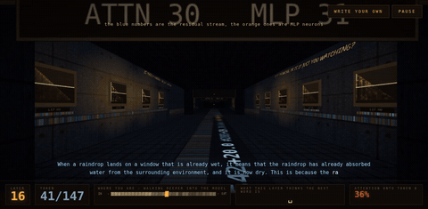

# resi-doom · E1M1

**You walk around inside a language model. It looks like Doom.**



A tunnel of **29 chambers, one per layer** of Qwen3-0.6B. `W` forward, `S` back,
that's the whole control scheme. Press **GENERATE** and the model starts
thinking — every sign in the tunnel rewrites itself, token by token.

- **sign over each door** — the logit lens: the word that layer would say now
- **how dark a chamber is** — how much of its attention goes into the first token
- **red beams pointing backwards** — heads staring into that first token
- **the sigils** — one spoke per head, drawn from its own numbers. Nobody can
  read them yet. That is the point.

## The two things the level is built around

| | |
|---|---|
| **The answer doesn't fade in, it switches on.** | Layers 1–21 read as broken C++ and Chinese fragments. Layer 22 reads `' Paris'` at p = 0.61. |
| **Layers 3–21 pour up to 84 % of their attention into the first token**, which means nothing. | The *attention sink* ([Xiao 2023](https://arxiv.org/abs/2309.17453)). At layer 22 it drops to ~1 %. Two measurements, same boundary. |

## Three ways in

**RECORDED** Qwen3-0.6B, 220 tokens, thinking on · **YOUR OWN SENTENCE**
SmolLM2-135M runs in your tab, 177 MB once · **CONNECT BRAINSCOPE** your own
model, live, through [brainscope](https://github.com/moudrkat/brainscope).

`IDDQD` `IDKFA` `IDCLIP` `IDDT` work. GENERATE pauses and resumes.
`?auto=1` walks by itself, for recording.

<details><summary>What is measured, what I invented, and what the live mode costs</summary>

The floor plan is invented — a corridor had to be some shape. The lights,
signs, beams and sigils all come from one forward pass over a real generation
(`tools/compile_wad.py`, on a GPU).

The **logit lens is an approximation**: it pushes mid-stack states through a
final norm and unembedding that were never meant for them. The babbling middle
of the tunnel may be the instrument, not the model — a
[tuned lens](https://arxiv.org/abs/2303.08112) is the fix. One prompt, one
model, greedy decoding. Nothing here is a statistic.

The published ONNX exports were no use for the browser: they emit only `logits`
and `present.N.key/value`. So `tools/export_level_onnx.py` exports a graph that
**emits the level itself** — lens argmax per layer, per-head sink and entropy —
a few hundred numbers per token instead of megabytes. Verified against PyTorch:
`lens_id` exact, floats to 3e-5.

That graph then has to be quantised, and it is not free (one prompt,
`The capital of France is`):

| build | size | signs identical to fp32 | says |
|---|---|---|---|
| fp32 | 545 MB | 31/31 | ` Paris` |
| 8-bit | 240 MB | 31/31 | ` Paris` |
| **4-bit blk32 — shipped** | **177 MB** | **28/31** | ` Paris` |
| 4-bit blk64 | 177 MB | 21/31 | ` the` |

8-bit is the honest build, but `onnxruntime-web` runs only the 4-bit
`MatMulNBits` kernel. So in your tab about three of thirty-one signs differ
from full precision. The recorded level has no such caveat.

brainscope mode is **untested against a live server**; per-head sink is not in
its websocket payload, so beams there fall back to `attn_top == 0`.

```bash
python tools/compile_wad.py Qwen/Qwen3-0.6B 220 wad.json   # needs a GPU
python -m http.server 8778
```
</details>
